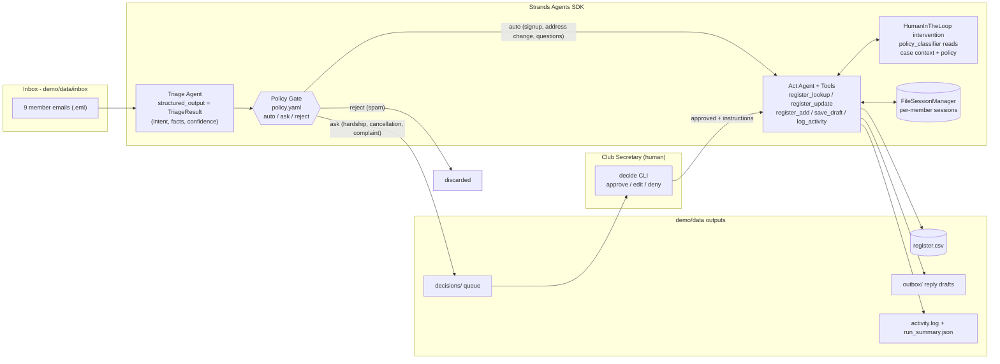

[Deutsch](/projects/clubsteward/) · **English** · [Einfache Sprache (DE)](/projects/clubsteward/#in-einfachen-worten)

## Inspiration

Clubs run on burned-out volunteers. Every club secretary — sports club, parent council, scout group — spends 5–10 hours a week on member email: registrations, address changes, schedule questions. And once a month, a letter arrives that needs a human heart, like a single parent asking for a fee waiver.

We wanted an agent that takes the repetitive 80 % off that plate — **without ever touching the 20 % that deserve human judgment.** Not "AI does everything," but an agent that knows exactly where to stop.

## What it does

ClubSteward processes the club inbox overnight, unsupervised. Every email is triaged (structured extraction: intent, facts, confidence), the member register is updated, warm on-brand replies are drafted — and **only genuine decision questions** reach a human: hardship waivers, mid-season cancellations, complaints. Each becomes a decision card: the original email, what the agent understood, what it proposes — and the exact policy line that escalated (*"Why you?"* — in the club's own language). Spam is silently discarded.

**Escalation happens on conditions, not just intents:** a simple registration runs automatically — the same registration mentioning an asthma inhaler gets flagged `medical` and stopped by the club's `ask_if` rule. Six demo clubs in three languages (German, English, Spanish); replies always arrive in the member's language, signed by the club.

The **web console** is the secretary's morning: step through emails live (mail on the left, agent analysis on the right), approve with an instruction, compare every draft side-by-side with the email it answers. **Nothing is ever sent automatically.** A full night costs about one cent.

## How it's built

- **Strands Agents SDK** (Python): two specialized agents — a triage agent with `structured_output` (Pydantic) and an act agent with five custom tools — run inside the SDK's **HumanInTheLoop intervention** with our own policy-driven approval classifier. Read-tools run freely, writes need policy or a human, unknown tools fail closed.
- **Policy as Data**: the entire club governance is a 30-line YAML that drives routing (auto/ask/reject), the runtime approval classifier, and reply tone. Volunteers edit YAML, not code.
- **Web console**: FastAPI + vanilla JS, no build step — the same pipeline a judge can drive live: *Reset data → Process next mail → Approve + instruct → Run night/Stop*.
- **GLM (Z.ai)** via LiteLLM's OpenAI-compatible provider. No cloud, no accounts — runs on a laptop.
- **Eval harness**: a labeled 10-mail corpus regression-tests triage accuracy on every change.
- **Replay mode**: judges without an API key play back a recorded real session, clearly labeled as a recording.

## Architecture





*Source: [`docs/architecture.mmd`](https://github.com/derKosi/clubsteward/blob/main/docs/architecture.mmd) — the same file the repo renders.*

## The console in action

## Challenges

- Making "only ask a human when it matters" an **engineered property**, not a vibe. Solved with three inspectable layers — policy route (auto/ask/reject), tool category gating, per-case context. The same YAML drives all three.
- **The model was overconfident-wrong in both directions.** A polite inquiry with a fee-relief undertone triaged as a plain "question" (our eval harness caught it — the fix is regression-tested). Another email sat at 90 % confidence on a partial address change: confidence alone wasn't enough, so condition flags (`ask_if: billing_address_unclear`) and `min_confidence` were added — below the threshold the agent asks instead of guessing.
- **Governance must speak the club's language**: decision rationales are generated in the club's locale — a German board reads *"Why you?"* Policy transparency a volunteer actually reads.

## Accomplishments

- The agent **invents nothing**: it flagged a "brother is already in the club" claim it couldn't verify instead of granting the sibling discount.
- Escalation is **explainable to non-programmers**: every decision card shows the exact policy line that stopped the agent.
- A complete, honest product loop — overnight run → morning decision cards → updated register and outbox — for about **one cent per night**, fully local except the single LLM call.

## What we learned

Autonomy is a spectrum you can shape **data-driven**. The hardest part wasn't making the agent capable — it was engineering the places where it must *stop*. For volunteer organizations, the policy file is the actual product: governance a non-programmer can read, edit, and trust.

## What's next

- IMAP/SMTP adapter for real mailboxes (same pipeline, folder boundaries stay)
- Multi-club hosting with per-club policy files
- Optional managed runtime for clubs that don't want a laptop running overnight

## In plain words (DE)

Die ausführliche deutsche Fassung inklusive einfacher Sprache steht auf der [deutschen Projektseite](/projects/clubsteward/#in-einfachen-worten).
